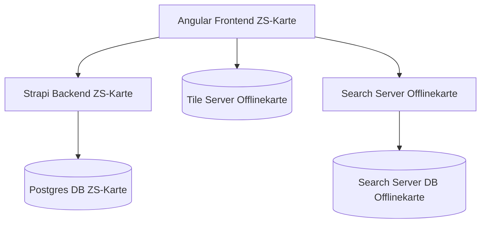
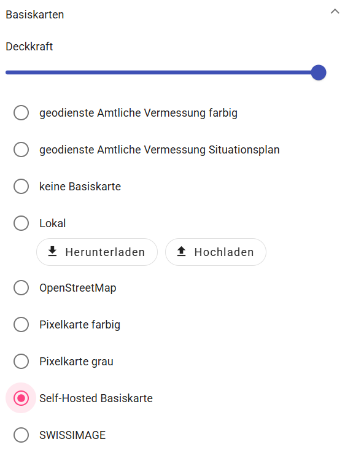
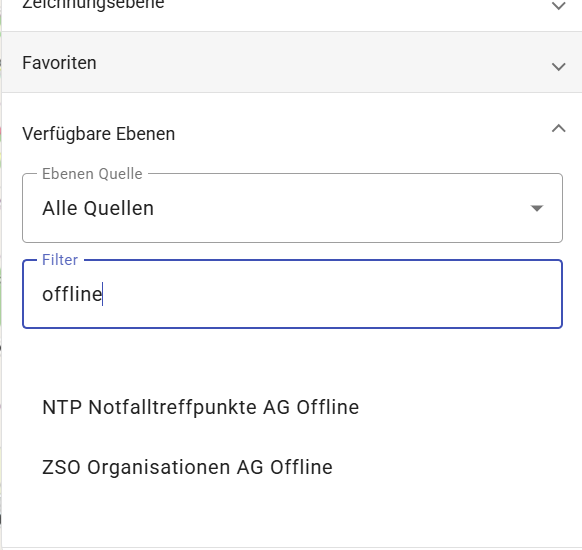
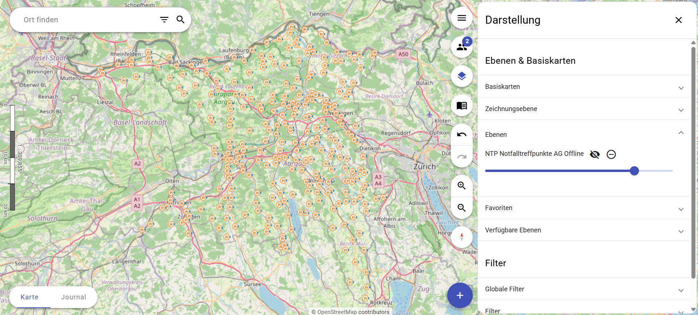
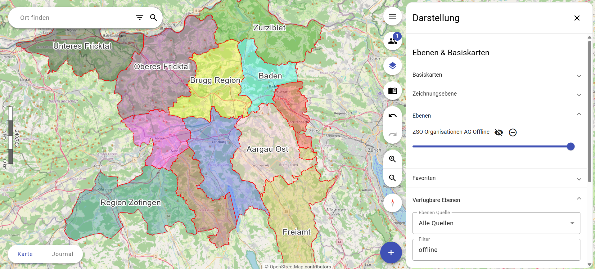

# Documentation

## Architecture
The Offlinekarte architecture consist of the following dockerised components:

## Search server
The search server provides search results for the zskarte search function.

While the original zskarte project fetches data directly from Geo Admin, Offlinekarte hosts a dedicated search server to ensure offline functionality.

### Data sources
The data for the search server is obtained automatically during the initialization phase of the project. It is recommended to update the data on a regular basis in a 6 to 12 month interval.  
The data fetched by the search server is optained from the following sources:

- [csv_LV95_LN02 swissnames3d](https://www.swisstopo.admin.ch/en/landscape-model-swissnames3d) Get newest csv file (swissnames3d_<year>_2056.csv.zip) e.g. swissnames3d_2026_2056.csv.zip

- [pure_adr: amtl. address verzeichnis](https://www.swisstopo.admin.ch/de/amtliches-verzeichnis-der-gebaeudeadressen) Get newest csv file e.g. amtliches-gebaeudeadressverzeichnis_ch_2056.csv.zip

- [pure_str: amtl str verzeichnis](https://www.swisstopo.admin.ch/de/amtliches-verzeichnis-der-strassen) Get newest csv file e.g. amtliches-strassenverzeichnis_ch_2056.csv.zip

- [AMTOVZ_CSV_WGS84: amtl ortschaftsverz mit plz](https://www.swisstopo.admin.ch/de/amtliches-ortschaftenverzeichnis) Download csv, IMPORTANT with number 4236 and not 2056! e.g. ortschaftenverzeichnis_plz_4326.csv.zip

## Map server

The map tile server provides an offline map layer for use without internet connectivity.
The map layer is integrated into zskarte as an additional map layer `Basiskarten` called `Self-hosted Basiskarten`. If the internet is available, the user can choose between the self-hosted map layer and other map layers from Swisstopo, OpenStreetMap, etc., with additional features such as satellite imagery. If no internet is available, the user is limited to the `Self-hosted Basiskarten`.

### Data source
The data for the tile server is obtained automatically during the initialization phase of the project. It is recommended to update the data on a regular basis in a 6 to 12 month interval.  
The data fetched is optained from the following source: [Geo Admin Vector Tiles](https://docs.geo.admin.ch/visualize-data/vector-tiles.html)

## Offline map layers (Ebenen)
Since the ZS Karte requests map layers (Ebenen) directly from third party APIs (e.g. Geo admin) these functions would not be available in case of internet failure. For this reason, some map layers were made offline compatible and integrated in the selection of available map layers (Ebenen).

Unless specified otherwise, the data needed for the layers are gathered during the initialization phase.  It is recommended to update the data on a regular basis in a 6 to 12 month interval. The data is then placed within the zskarte folder and is therefore available directly within the application without the need of a internet connection. During initialization of the zskarte database the layers are created alongside the default layers from zskarte.

## Notfalltreffpunkt NTP layer Aargau
For offline use, a layer with NTPs has been added. The layer can be opened by searching in the list of available layers and is called `NTP Notfalltreffpunkte AG Offline`.

### Data source

The data fetched is optained from the following source: [Geo Admin BABS Notfalltreffpunkte](https://data.geo.admin.ch/browser/index.html#/collections/ch.babs.notfalltreffpunkte/items/notfalltreffpunkte). 

Note: While the API provides all NTPs in Switzerland, the list is filtered to only include NTPs in Aargau.

After fetching the NTPs are stored in the `GeoJSON` format.

## ZSO Organisationen Aargau Offline
A layer showing the Zivilschutz Organisationen in Aargau has been added. The layer can be opened by searching in the list of available layers and is called `ZSO Organisationen AG Offline`.

### Data source

The data fetched is optained from the following source: [Kanton Aargau Geodaten Bevölkerungsschutzregionen](https://www.ag.ch/de/themen/staat-politik/daten-und-zahlen/geoportal/geodaten/geodatenliste?rewriteRemoteUrl=/details/AGIS.amb_bsr/Shapefile)

The data is in the Shapefile format and is stored as is in the zip format.